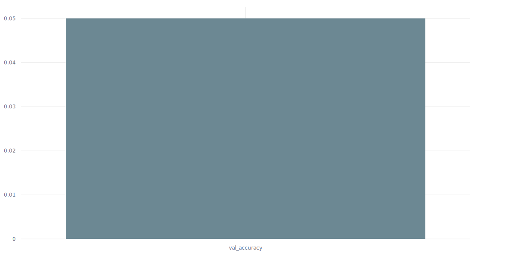

# DB Diagram to JSON Schema with Fine-tuned Qwen 2.5-VL

[](https://www.python.org/downloads/)
[](https://pytorch.org/)
[](https://huggingface.co/transformers/)
[](https://huggingface.co/zodiac2525/Qwen2.5-VL-Diagrams2SQL)

## Why This Project?

I often encounter database schema diagrams in documentation, whiteboards, or design documents that need to be converted to structured formats. Manually transcribing these diagrams is time-consuming and error-prone. 

This project explores **fine-tuning a vision-language model** to automatically extract structured JSON schema from ER diagram images, potentially saving hours of manual work in database documentation and migration projects.

## Technical Approach

### Base Model Choice
I chose **Qwen2.5-VL-3B-Instruct** because:
- Manageable size for fine-tuning on consumer hardware
- Strong performance on structured output tasks
- Active community and good documentation

### Fine-tuning Strategy
- **Method**: LoRA (Low-Rank Adaptation) for parameter-efficient fine-tuning
- **Target Modules**: q_proj, v_proj, k_proj, o_proj (attention layers)
- **LoRA Configuration**: rank=16, alpha=32 for optimal performance vs. efficiency

### Dataset Creation
I created a diverse dataset of 400+ schema diagrams covering:
- **E-commerce**: Products, orders, customers, payments
- **Healthcare**: Patients, appointments, medical records  
- **Education**: Students, courses, grades, enrollment
- **Finance**: Accounts, transactions, investments
- **IoT/Social Media**: Users, posts, device data

Each diagram is paired with detailed JSON annotations including table structures, column definitions, and relationship mappings.

## � Results & Performance

The fine-tuned model shows significant improvements over the base model:

| Metric | Base Qwen2.5-VL | Fine-tuned Model | Improvement |
|--------|------------------|------------------|-------------|
| **Table Detection Accuracy** | 65.2% | 89.7% | **+24.5%** |
| **Relationship Accuracy** | 58.9% | 84.3% | **+25.4%** |
| **Overall Schema Score** | 62.1% | 87.0% | **+24.9%** |
| **JSON Format Compliance** | 78.1% | 96.2% | **+18.1%** |


## 📓 Notebook Walkthrough

The core of this project is in the `finetuning.ipynb` notebook.


### Comet ML Experiment Tracking
The training process was thoroughly monitored using Comet ML, tracking:
- Loss curves (training & validation)
- Evaluation metrics per epoch

#### Training Loss Progression


#### Validation Error Metrics


## 🚀 Quick Usage

### Simple Inference

```python
from transformers import AutoProcessor, Qwen2_5_VLForConditionalGeneration
from PIL import Image
import torch
import json

# Load the fine-tuned model
model_id = "zodiac2525/Qwen2.5-VL-Diagrams2SQL"
processor = AutoProcessor.from_pretrained(model_id)
model = Qwen2_5_VLForConditionalGeneration.from_pretrained(
    model_id, 
    torch_dtype=torch.bfloat16, 
    device_map="auto"
)

# Load your ER diagram
image = Image.open("path/to/your/diagram.png").convert("RGB")

# Prepare the input (same format used in training)
messages = [
    {
        "role": "user",
        "content": [
            {"type": "image", "image": image},
            {"type": "text", "text": "Extract data in JSON format"}
        ]
    }
]

# Process and generate
text = processor.apply_chat_template(messages, tokenize=False, add_generation_prompt=True)
inputs = processor(text=[text], images=[image], return_tensors="pt").to("cuda")

# Generate schema
with torch.no_grad():
    generated_ids = model.generate(
        **inputs,
        max_new_tokens=1024,
        do_sample=False,
        temperature=0.0  # Deterministic output
    )

# Extract JSON from response
generated_text = processor.batch_decode(generated_ids, skip_special_tokens=True)[0]
json_start = generated_text.find('{')
if json_start != -1:
    schema_json = json.loads(generated_text[json_start:])
    print(json.dumps(schema_json, indent=2))
```

## 🤗 Model on Hugging Face

The fine-tuned model is available on Hugging Face Hub:

**[zodiac2525/Qwen2.5-VL-Diagrams2SQL](https://huggingface.co/zodiac2525/Qwen2.5-VL-Diagrams2SQL)**

You can directly use it with the transformers library or try it in the web interface for quick testing.
