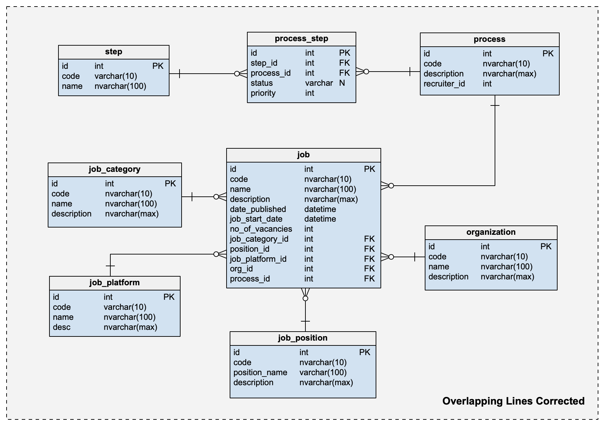

# DB Diagram to JSON Schema with Fine-Each diagram
## Why This Project?

While experimenting with **Qwen2.5-VL** across various vision-language tasks, I discovered that the base model struggled significantly with structured diagram interpretation. When I fed it ER diagrams and database schemas, the results were inconsistent and often incomplete - missing tables, incorrectly identifying relationships, or producing malformed JSON outputs.

This is one of the example that I tried: 



and Here's the output: 

```json
{
  "students": {
    "id": "INTEGER",
    "fn": "VARCHAR(255)",
    "email": "VARCHAR(255)",
    "date_of_birth": "DATE",
    "address": "TEXT",
    "department_id": "INTEGER"
  },
  "courses": {
    "id": "INTEGER",
    "fn": "VARCHAR(255)",
    "email": "VARCHAR(255)",
    "date_of_birth": "DATE",
    "address": "TEXT",
    "department_id": "INTEGER"
  },
  "teachers": {
    "id": "INTEGER",
    "fn": "VARCHAR(255)",
    "email": "VARCHAR(255)",
    "date_of_birth": "DATE",
    "address": "TEXT",
    "department_id": "INTEGER"
  }
}
```

They are terriable ayy? As a result, this leads me to explore **fine-tuning approaches**. I decided to collect and create a specialized dataset and fine-tune specifically for database diagram understanding.

Let's look at the overview of the qwen model first. 

## Model Architecture Overview

The Qwen2.5-VL architecture combines vision and language understanding through a sophisticated multi-modal design:


**Key Components:**
- **Vision Encoder**: Processes input images and converts them to visual tokens
- **Vision-Language Adapter**: Bridges visual and textual representations
- **Language Model Backbone**: Qwen2.5 transformer for text generation and reasoning
- **Multi-modal Fusion**: Seamlessly integrates visual and textual information for coherent outputs


## Onto the finetuning part

### The strategy
- **Method**: LoRA (Low-Rank Adaptation) for parameter-efficient fine-tuning
- **Target Modules**: q_proj, v_proj, k_proj, o_proj (attention layers)
- **LoRA Configuration**: rank=16, alpha=32 for optimal performance vs. efficiency

Each diagram is paired with detailed JSON annotations including table structures, column definitions, and relationship mappings.

## Notebook 

You could find the training process from `finetuning.ipynb` notebook.

### Comet ML Tracking
The training process was thoroughly monitored using Comet ML. You might need to sign up to get the api:

#### Training Loss Progression


## The Results

The fine-tuned model shows significant improvements over the base model:

| Metric | Base Qwen2.5-VL | Fine-tuned Model 
|--------|------------------|------------------
| **Table Detection Accuracy** | 0.0% | 89.2% 
| **Relationship Accuracy** | 0% | 90% 

*   The fine-tuned model achieved significantly higher accuracy in identifying the number of tables (approximately 89.2%) and relationships (90.0%) compared to the base model.
*   The base model was unable to produce valid output for this task, resulting in 0.0% accuracy for both table and relationship counts on the benchmark subset.

## Comparision between Base Model vs Fine-tuned Model

Our input:


### Base Model Output
```json
{
  "tables": [
    {
      "name": "grades",
      "columns": [
        { "name": "id", "type": "INTEGER", "is_pk": true },
        { "name": "salary", "type": "DECIMAL_12_2" },
        { "name": "quantity", "type": "INTEGER" },
        { "name": "phone", "type": "VARCHAR_20" },
        { "name": "name", "type": "VARCHAR_255", "is_not_null": true },
        { "name": "date_of_birth", "type": "DATE" },
        { "name": "rating", "type": "FLOAT" },
        { "name": "enrollment_id", "type": "INTEGER", "is_not_null": true }
      ],
      "primary_key": "id"
    },
    {
      "name": "enrollments",
      "columns": [
        { "name": "id", "type": "INTEGER", "is_pk": true },
        { "name": "updated_at", "type": "TIMESTAMP" },
        { "name": "date_of_birth", "type": "DATE" },
        { "name": "description", "type": "TEXT" },
        { "name": "email", "type": "VARCHAR_255", "is_unique": true },
        { "name": "price", "type": "DECIMAL_10_2" },
        { "name": "is_active", "type": "BOOLEAN" },
        { "name": "student_id", "type": "INTEGER", "is_not_null": true },
        { "name": "course_id", "type": "INTEGER", "is_not_null": true }
      ],
      "foreign_keys": [
        { "table": "courses", "column": "course_id", "foreign_table": "enrollments", "foreign_column": "id" },
        { "table": "students", "column": "student_id", "foreign_table": "enrollments", "foreign_column": "id" }
      ]
    },
    {
      "name": "students",
      "columns": [
        { "name": "id", "type": "INTEGER", "is_pk": true },
        { "name": "date_of_birth", "type": "DATE" },
        { "name": "email", "type": "VARCHAR_255", "is_unique": true },
        { "name": "is_active", "type": "BOOLEAN" },
        { "name": "rating", "type": "FLOAT" },
        { "name": "name", "type": "VARCHAR_255", "is_not_null": true },
        { "name": "updated_at", "type": "TIMESTAMP" },
        { "name": "address", "type": "TEXT" }
      ],
      "primary_key": "id"
    },
    {
      "name": "courses",
      "columns": [
        { "name": "id", "type": "INTEGER", "is_pk": true },
        { "name": "created_at", "type": "TIMESTAMP" },
        { "name": "address", "type": "TEXT" },
        { "name": "salary", "type": "DECIMAL_12_2" },
        { "name": "price", "type": "DECIMAL_10_2" },
        { "name": "name", "type": "VARCHAR_255", "is_not_null": true },
        { "name": "email", "type": "VARCHAR_255", "is_unique": true },
        { "name": "teacher_id", "type": "INTEGER", "is_not_null": true },
        { "name": "department_id", "type": "INTEGER", "is_not_null": true }
      ],
      "foreign_keys": [
        { "table": "teachers", "column": "teacher_id", "foreign_table": "courses", "foreign_column": "id" },
        { "table": "departments", "column": "department_id", "foreign_table": "courses", "foreign_column": "id" }
      ]
    },
    {
      "name": "teachers",
      "columns": [
        { "name": "id", "type": "INTEGER", "is_pk": true },
        { "name": "name", "type": "VARCHAR_255", "is_not_null": true },
        { "name": "description", "type": "TEXT" },
        { "name": "quantity", "type": "INTEGER" },
        { "name": "is_active", "type": "BOOLEAN" },
        { "name": "date_of_birth", "type": "DATE" },
        { "name": "address", "type": "TEXT" },
        { "name": "rating", "type": "FLOAT" }
      ]
    },
    {
      "name": "departments",
      "columns": [
        { "name": "id", "type": "INTEGER", "is_pk": true },
        { "name": "salary", "type": "DECIMAL_12_2" },
        { "name": "date_of_birth", "type": "DATE" },
        { "name": "is_active", "type": "BOOLEAN" },
        { "name": "quantity", "type": "INTEGER" }
      ]
    }
  ],
  "data_constraints": [
    { "table": "students", "column": "name", "constraint_type": "NOT_NULL" },
    { "table": "courses", "column": "name", "constraint_type": "NOT_NULL" },
    { "table": "teachers", "column": "name", "constraint_type": "NOT_NULL" },
    { "table": "departments", "column": "name", "constraint_type": "NOT_NULL" }
  ]
}
```

### Fine-tuned Model Output
```json
{
  "domain": "school",
  "source": "programmatic",
  "tables": [
    {
      "name": "students",
      "columns": [
        {
          "name": "id",
          "type": "INTEGER",
          "primary_key": true
        },
        {
          "name": "date_of_birth",
          "type": "DATE"
        },
        {
          "name": "email",
          "type": "VARCHAR(255)",
          "unique": true
        },
        {
          "name": "is_active",
          "type": "BOOLEAN",
          "default": "true"
        },
        {
          "name": "rating",
          "type": "FLOAT"
        },
        {
          "name": "name",
          "type": "VARCHAR(255)",
          "nullable": false
        },
        {
          "name": "updated_at",
          "type": "TIMESTAMP",
          "default": "CURRENT_TIMESTAMP"
        },
        {
          "name": "address",
          "type": "TEXT"
        }
      ]
    }
  ],
  "relationships": [
    {
      "from_table": "enrollments",
      "to_table": "students",
      "from_column": "student_id",
      "to_column": "id",
      "type": "many_to_one"
    },
    {
      "from_table": "courses",
      "to_table": "teachers",
      "from_column": "teacher_id",
      "to_column": "id",
      "type": "many_to_one"
    }
  ]
}
```

### Differences

* The first output (Base Model) provides a relatively structured JSON schema of the database, detailing tables, columns, data types, and some constraints.
However, it suffers from several issues. 

* For example, foreign key relationships are inaccurately defined, with several self-references that misrepresent actual relational links between tables. Also, Constraints like NOT_NULL and UNIQUE are inconsistently applied. 

* In contrast, the second output is more logically consistent, cleanly structured, and directly usable. It embeds constraints such as primary_key, nullable, default, and unique within each column definition, making the schema easier to read and maintain. Foreign key relationships are explicitly and correctly defined under a relationships section using a normalized format, improving both accuracy and semantic transparency. Overall, the second schema is more complete, logically valid, and production-ready, making it the superior of the two.


## Inference 
Try the model yourself with this notebook:

[](https://colab.research.google.com/drive/1P2NvExoJN1HQLNz2xIQ3FPLPfcXDfMMF?usp=sharing)

Upload your own database diagrams and see the fine-tuned model convert them to structured JSON schemas in real-time.
## 🤗 Model on Hugging Face

The fine-tuned model is also available on Hugging Face Hub:

**[zodiac2525/Qwen2.5-VL-Diagrams2SQL](https://huggingface.co/zodiac2525/Qwen2.5-VL-Diagrams2SQL-v2)**

